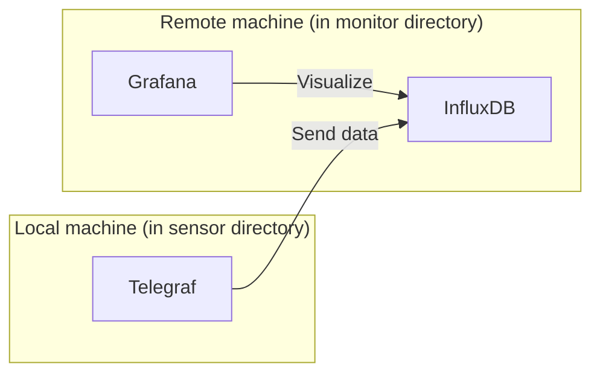

# co2-mini
Read data from a CO2 monitor device "CO2-mini" via USB

## Architecture



## Setup (Remote machine)
Create `monitor/myInfluxDBVolume` directory.

Create `.env` file.
```
DOCKER_INFLUXDB_INIT_MODE=setup
DOCKER_INFLUXDB_INIT_USERNAME=
DOCKER_INFLUXDB_INIT_PASSWORD=
DOCKER_INFLUXDB_INIT_ORG=
DOCKER_INFLUXDB_INIT_BUCKET=
GF_SERVER_ROOT_URL=http://localhost:8080
GF_SECURITY_ADMIN_PASSWORD=
```

Move to "monitor" directory.

Run `docker compose --env-file=../.env up`.

## Setup (Local machine)
Create `external` network.
```
docker network create external
```
TODO: This network setting is for test in local environment.

Create `sensor/telegraf.conf`.
```
[[inputs.socket_listener]]
    service_address = "udp://:8092"
    data_format = "influx"

[[outputs.influxdb_v2]]
    token = "${INFLUXDB_TOKEN}"
    organization = "${INFLUXDB_ORG}"
    bucket = "${INFLUXDB_BUCKET}"
```

SET "INFLUXDB_URL" environment variable. Check it with `docker network inspect external`.
```
$ENV:INFLUXDB_URL = "http://<IP_ADDR>:8086"  
```

Set "INFLUXDB_TOKEN" environment variable.
```
$ENV:INFLUXDB_TOKEN = "<TOKEN>"  
```

Move to "sensor" directory.

Run `docker compose --env-file=../.env up`.

Test sending data.
```
watch 'echo "test temperature=$(tr -dc 0-9 < /dev/urandom | fold -w 2 | head -1),humidity=$(tr -dc 0-9 < /dev/urandom | fold -w 2 | head -1)" | nc -4 -u -w 1 localhost 8092'
```
