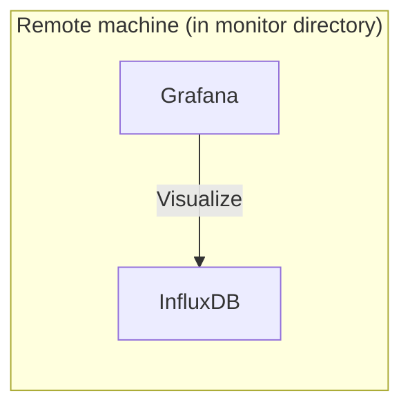

# co2-mini
Read data from a CO2 monitor device "CO2-mini" via USB

## Architecture



## Setup (Remote machine)
Create `monitor/myInfluxDBVolume` directory.

Create `.env` file.
```
DOCKER_INFLUXDB_INIT_MODE=setup
DOCKER_INFLUXDB_INIT_USERNAME=
DOCKER_INFLUXDB_INIT_PASSWORD=
DOCKER_INFLUXDB_INIT_ORG=
DOCKER_INFLUXDB_INIT_BUCKET=
GF_SERVER_ROOT_URL=http://localhost:8080
GF_SECURITY_ADMIN_PASSWORD=
```

Run `docker compose up`.
