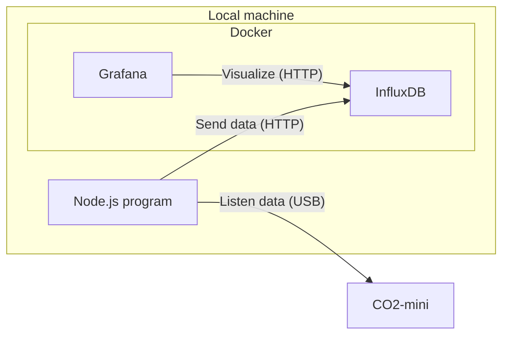

# co2-mini

Read data from a CO2 monitor device "CO2-mini" via USB and monitor the data.

## Architecture



## Setup

1. Create `external` network.

   ```
   docker network create external
   ```

   TODO: This network setting is for test in local environment.

1. Move to `monitor` directory.

1. Create `myInfluxDBVolume` directory.

1. Create `.env` file.

   ```
   DOCKER_INFLUXDB_INIT_MODE=setup
   DOCKER_INFLUXDB_INIT_USERNAME=<InfluxDB admin user name>
   DOCKER_INFLUXDB_INIT_PASSWORD=<InfluxDB admin password>
   DOCKER_INFLUXDB_INIT_ORG=<InfluxDB initial organization>
   DOCKER_INFLUXDB_INIT_BUCKET=<InfluxDB initial bucket>
   GF_SERVER_ROOT_URL=http://localhost:8080
   GF_SECURITY_ADMIN_PASSWORD=<Grafana admin password>
   ```

1. Run `docker compose --env-file=../.env up`.

1. Move to "sensor" directory.

1. Set environment variables.

   ```
   $env:INFLUXDB_BASE_URL = "http://localhost:8086"
   $ENV:INFLUXDB_TOKEN = "<InfluxDB user token (create if you don't know it)>"
   $ENV:INFLUXDB_ORG = "<InfluxDB organization>"
   $ENV:INFLUXDB_BUCKET = "<InfluxDB bucket>"
   ```

1. Run `tsc ./src`

1. Run `node ./dist/main.js`
